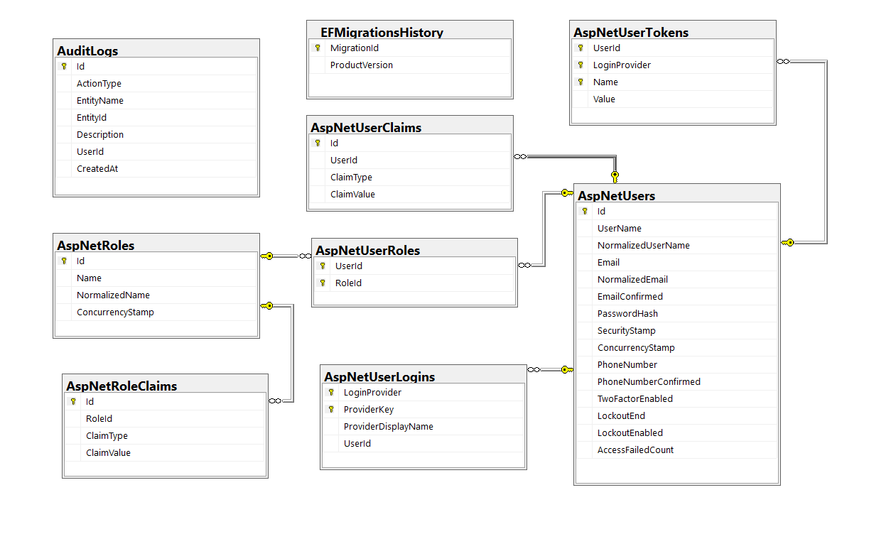

# 🚀 Smart Task Management System

<p align="center">
  
  
  
</p>

<p align="center">
  
  
  
</p>

---

> ⚡ A modern task management system with user-based architecture, dynamic UI, and audit logging

A scalable and production-style **task management system** built with **ASP.NET Core MVC, Entity Framework Core, and SQL Server**.

The application allows users to manage their tasks efficiently with a clean and modern interface, focusing on **user isolation**, **dynamic interactions**, and **clean architecture**.

---

## 🎬 Demo GIFs

<p align="center">
  
</p>

<p align="center">
  
  
</p>

---

## 🚀 Live Features

- Real-time task updates (AJAX)
- User-based task isolation
- Audit logging for all critical actions

---

## ✨ Key Features

- 🔐 User Authentication & Authorization (ASP.NET Core Identity)
- 📋 Task Management (CRUD + status + priority)
- 🗂 Category Management with color system
- 📊 Dynamic Dashboard with real-time updates
- ⚡ AJAX-based UI interactions
- 🧾 Audit Logging System (track all actions)
- 🎨 Modern UI (glassmorphism + gradients)
- 📱 Responsive design

---

## 🚀 Key Highlights

- User-based data isolation  
- Clean and scalable architecture  
- Real-time UI updates with AJAX  
- Audit logging for tracking system activity  
- Modern and responsive UI design  

---

## 🛠️ Tech Stack

- ASP.NET Core MVC (Backend)
- Entity Framework Core (ORM)
- SQL Server (Database)
- Bootstrap 5 (UI Framework)
- JavaScript (AJAX, DOM)
- HTML5 / CSS3

---

## 🎥 Feature Demonstrations

### 📊 Dashboard Overview


---

### 📋 Task Management

| List | Create | Edit |
|------|--------|------|
|  |  |  |

---

### 🗂 Category Management

| List | Create | Edit |
|------|--------|------|
|  |  |  |

---

### 🔐 Authentication

| Login | Register |
|------|----------|
|  |  |

---

### 👤 Profile Settings

| Email | Password |
|------|----------|
|  |  |

---

## 🧠 Database Design



---

## ⚙️ Installation

### 1. Clone the repository
```bash
git clone https://github.com/MertcanKayirici/SmartTaskManagementSystem.git
```
### 2. Open project

Open the solution file (`.sln`) using Visual Studio

### 3. Create database
```sql
SmartTaskManagementDb
```
### 4. Run SQL script
```bash
/DataBase/SmartTaskManagementDb.sql
```
### 5. Configure connection string
```json
"ConnectionStrings": {
  "DefaultConnection": "Server=.;Database=SmartTaskManagementDb;Trusted_Connection=True;TrustServerCertificate=True;"
}
```
### 6. Run project

Press F5 in Visual Studio 🚀

---

## 📌 Important Notes
- Ensure SQL Server is running
- Update connection string if needed
- Do not expose sensitive credentials

---

## 📂 Project Structure
- Controllers → Handles HTTP requests
- Models → Data structures & entities
- Views → UI components (Razor)
- Services → Business logic (AuditLogService)
- Database → SQL scripts & schema
- Screenshots → Project visuals

---

## 📌 Architecture Highlights
- MVC Architecture
- Dependency Injection
- Service Layer (AuditLogService)
- Entity Relationships
- User-based data design
- AJAX dynamic UI

---

## ⭐ Project Purpose

This project was built to simulate a real-world task management system and demonstrate practical backend development skills in a production-like environment:

- Backend architecture design
- Authentication & authorization implementation
- Dynamic UI development
- Audit logging and activity tracking

---

## 💡 Why This Project Matters

This is not just a simple CRUD app.

It includes:

- User-based architecture
- Audit logging system
- Dynamic UI interactions
- Clean and scalable structure

This makes it closer to a real production system.

---

## 👨‍💻 Developer

**Mertcan Kayırıcı**  
Backend-Focused Full Stack Developer  

- 💼 Focus: ASP.NET Core, SQL Server, Backend Architecture  
- 🔗 GitHub: https://github.com/MertcanKayirici
  
---

## ⭐️ Support

> If you like this project, don't forget to star ⭐ the repository.
