# 🚀 Smart Task Management System


---

> A modern, user-based task management system built with ASP.NET Core MVC, featuring audit logging, dynamic UI, and smart task handling.

---

## 🎯 Overview

Smart Task Management System is a **full-stack web application** that allows users to manage their tasks efficiently with a clean and modern interface.

The system includes:

- User authentication & authorization (ASP.NET Core Identity)
- Task & category management
- Audit logging system
- Dynamic UI interactions
- Responsive modern design

---

## 🧩 Features

### 🔐 Authentication & User Management
- Register / Login / Logout system
- Identity-based user authentication
- User-specific data isolation

---

### 📋 Task Management
- Create, update, delete tasks
- Set priority (Low, Medium, High)
- Set status (Pending, In Progress, Completed)
- Due date tracking
- Live preview while creating tasks
- Simple AI-based priority suggestion

---

### 🗂 Category System
- Create and manage categories
- Assign colors to categories
- Active / Passive category state
- Category-based task grouping

---

### 📊 Dashboard
- Overview of tasks
- Clean UI cards and layout
- Real-time data reflection

---

### 🧾 Audit Logging System
- Tracks all user actions:
  - Create
  - Update
  - Delete
- Stores:
  - Action type
  - Entity name
  - Description
  - User info
  - Timestamp

---

### 🎨 UI / UX
- Modern glassmorphism design
- Gradient-based layout
- Responsive navbar
- User avatar + dropdown menu
- Clean and consistent design system

---

## 🖼 Demo

| Dashboard Overview | Task Management Flow | Category Integration |
|------------------|--------------------|----------------------|
|  | 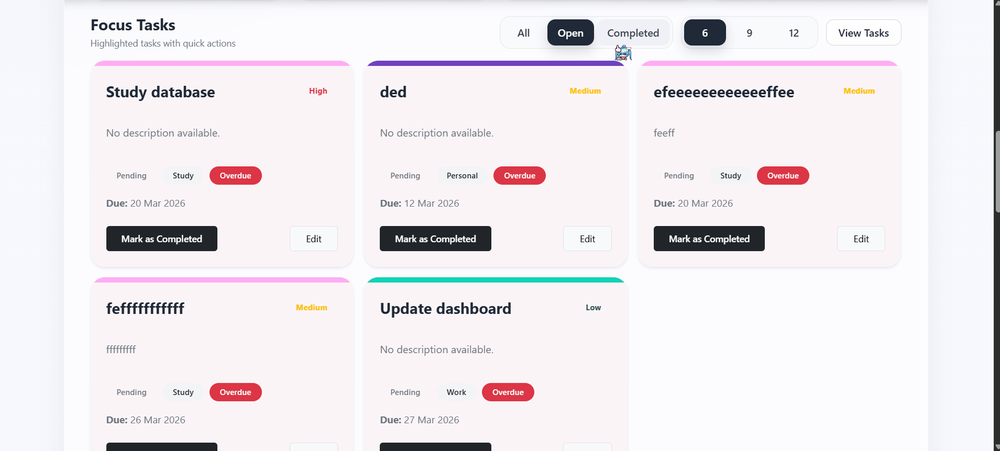 |  |

---

## 📸 Screenshots

### 🔐 Authentication

#### Login
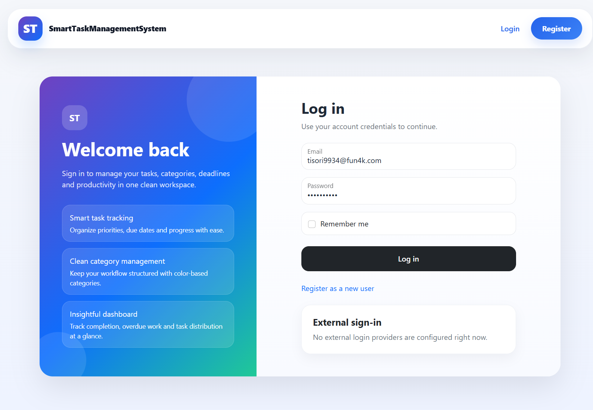

#### Register
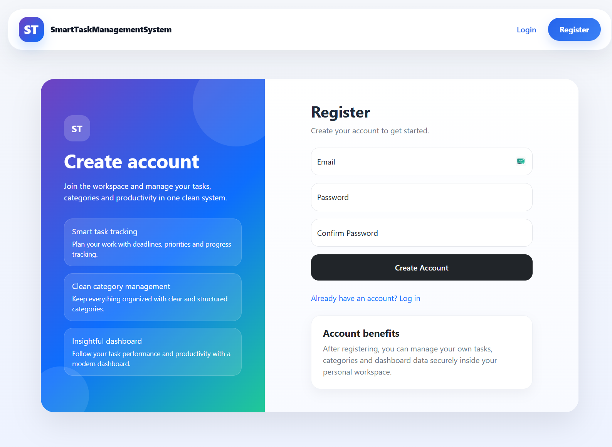

---

### 🏠 Landing Page
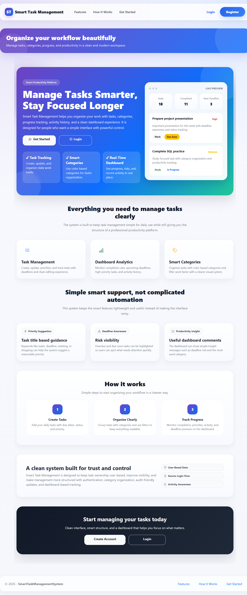

---

### 📊 Dashboard
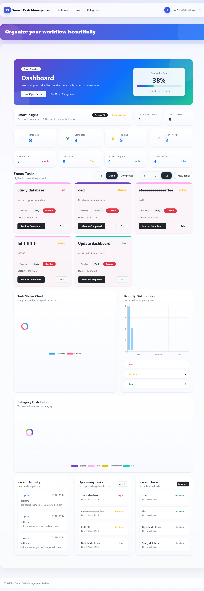

---

### 📋 Task Management

#### Task List
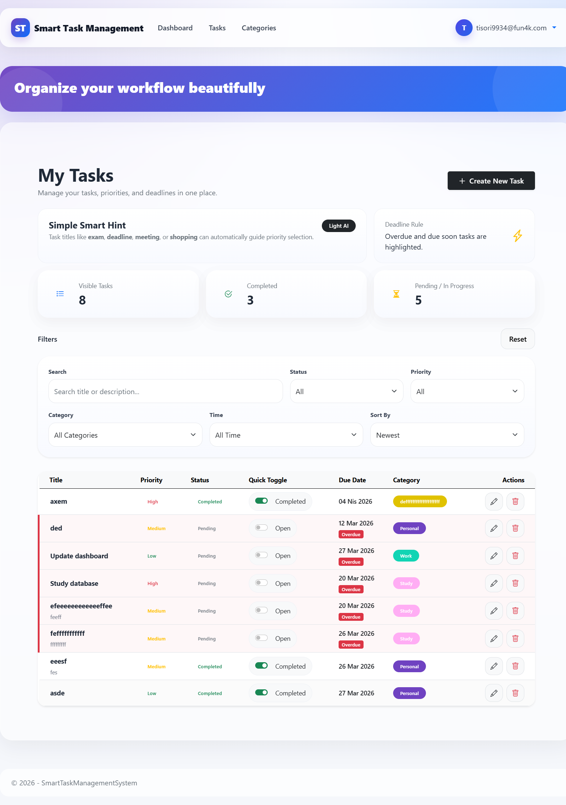

#### Create Task
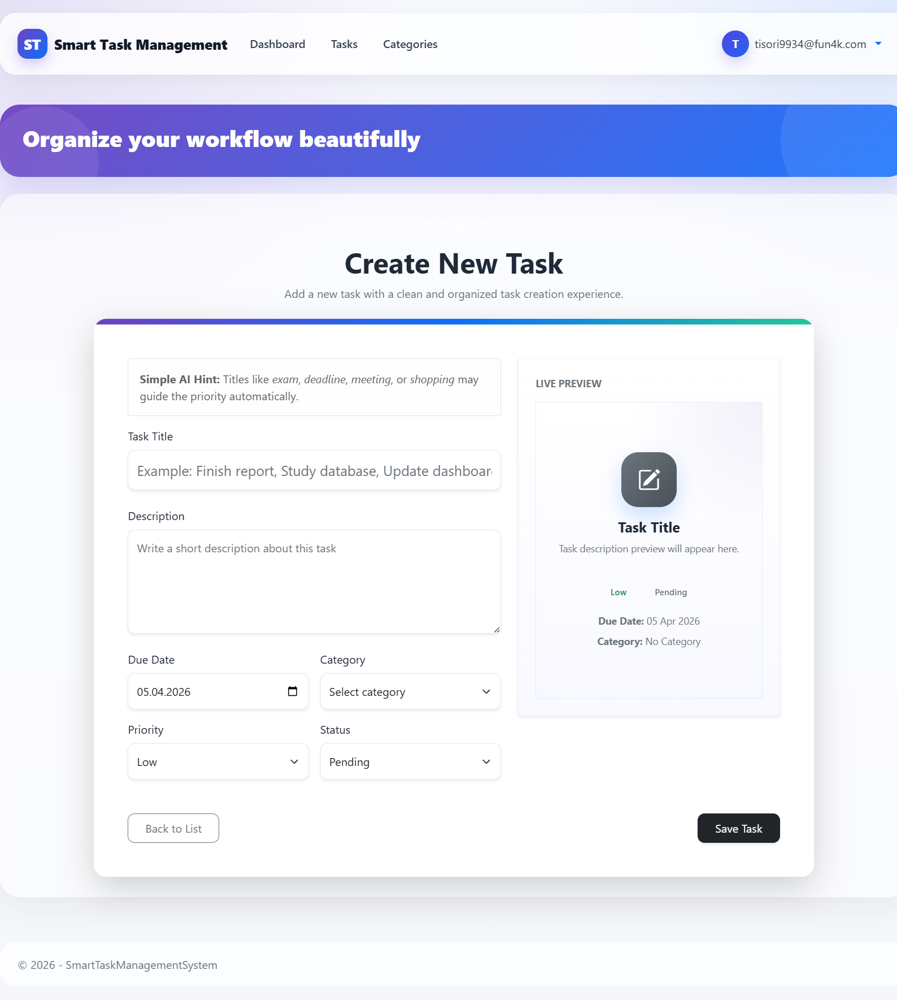

#### Edit Task
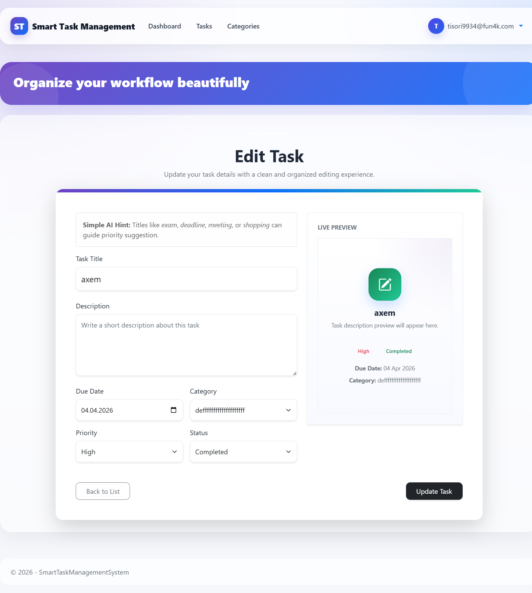

---

### 🗂 Category Management

#### Category List
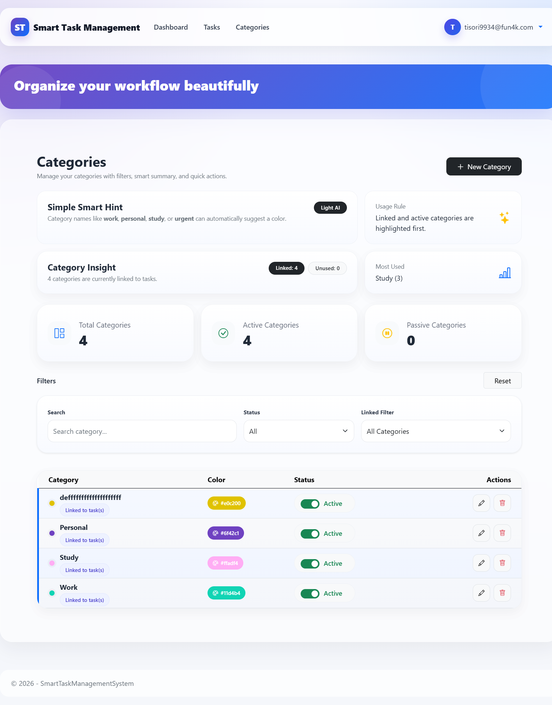

#### Create Category
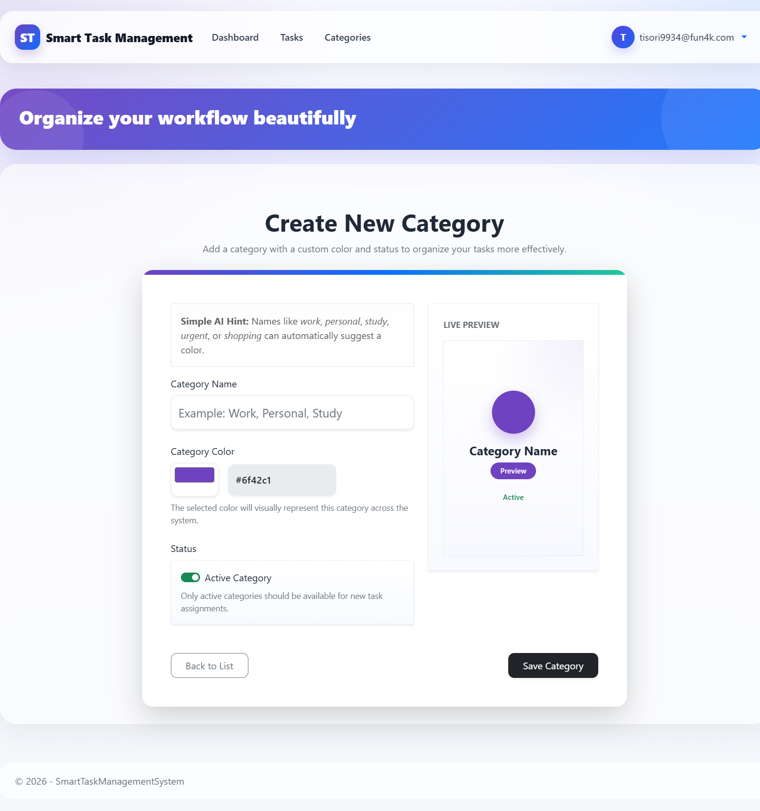

#### Edit Category
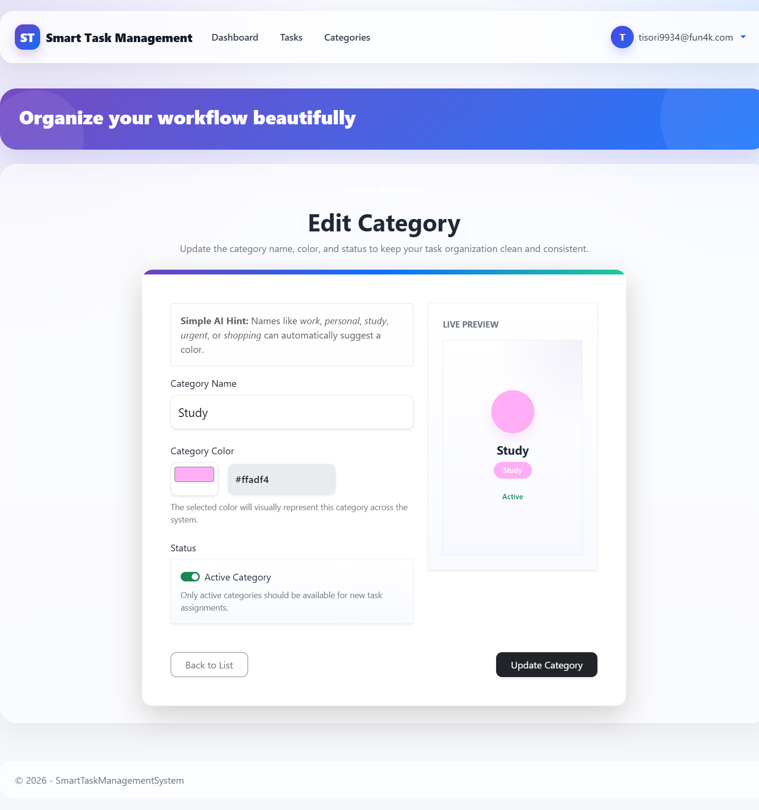

---

### 👤 Profile

#### Email Settings
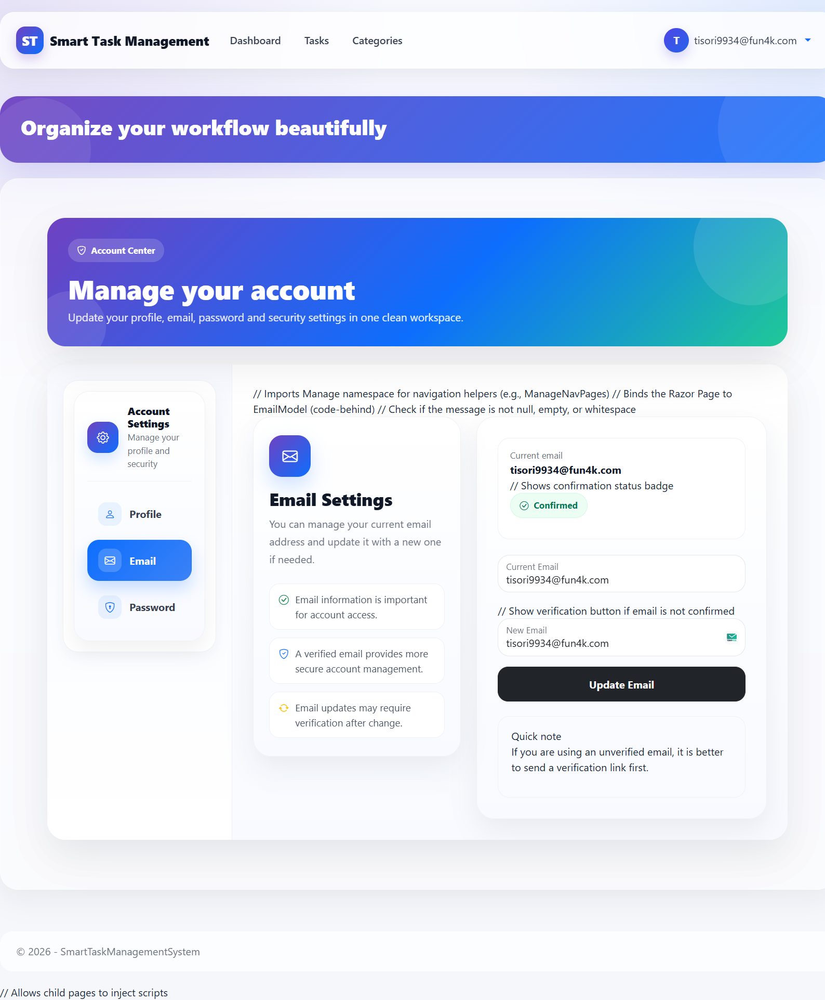

#### Password Settings
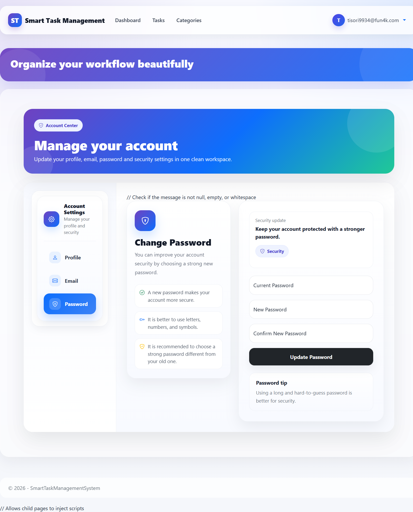

---

### 🧠 System Architecture

#### Diagram


---

## 🛠 Tech Stack

**Backend**
- ASP.NET Core MVC
- Entity Framework Core
- ASP.NET Core Identity

**Frontend**
- HTML5 / CSS3
- Bootstrap 5
- JavaScript (DOM, Event Handling)

**Database**
- SQL Server

---

## 🗄 Database

Detailed database structure, diagram and SQL script are available in:

📁 `DataBase/`

This folder includes:

- `README.md`
- `SmartTaskManagementDb.sql`
- `Diyagram.png`

---

## ⚙️ Installation

```bash
git clone https://github.com/yourusername/SmartTaskManagementSystem.git
cd SmartTaskManagementSystem
dotnet run
```

## 🔧 Configuration

Update your connection string in:
```md
appsettings.json
```
Example:
```json
"ConnectionStrings": {
  "DefaultConnection": "Server=.;Database=SmartTaskManagementDb;Trusted_Connection=True;TrustServerCertificate=True;"
}
```

---

## 🧠 Key Concepts Used
- MVC Architecture
- Dependency Injection
- Entity Relationships
- Service Layer (AuditLogService)
- Authentication & Authorization
- Responsive UI Design

---

## 🚀 Future Improvements
- AJAX-based full dynamic updates
- Advanced dashboard analytics
- Email notifications
- Role-based authorization

---

## 👨‍💻 Author

**Mertcan Kayırıcı**

- Backend-focused Full Stack Developer  
- Passionate about clean architecture and modern UI design

---

## ⭐ Project Status

> 🚧 Actively being improved and expanded

---
